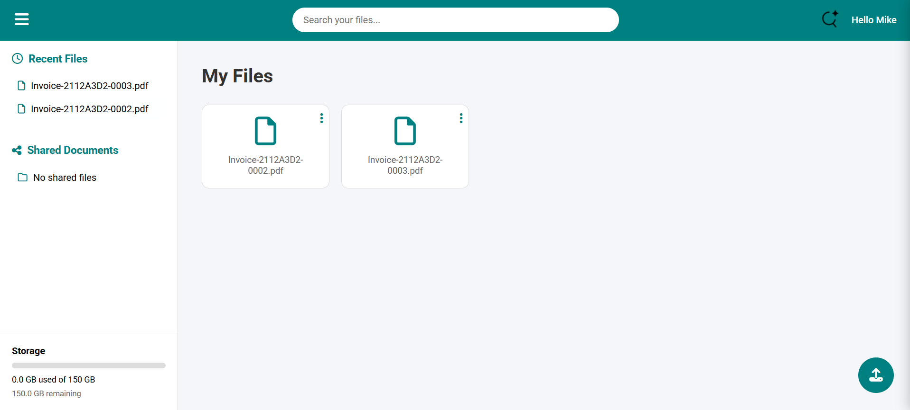
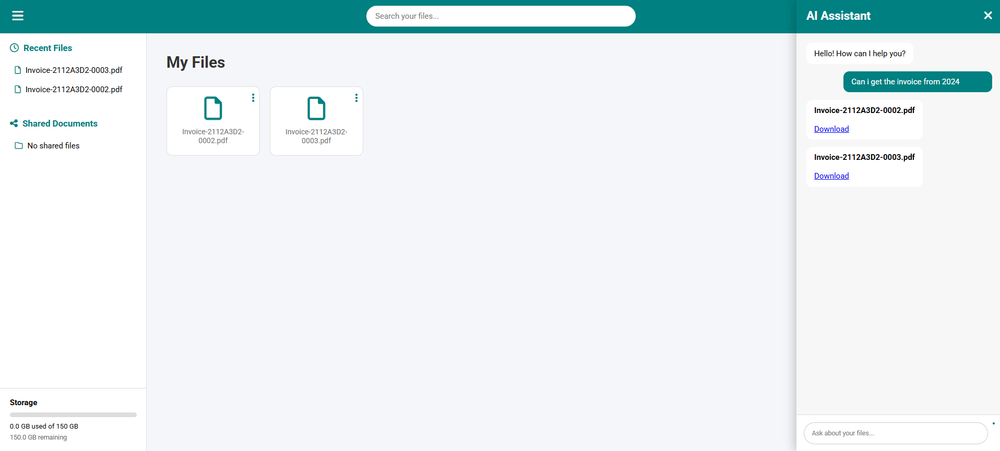

# AI-Powered Personal Cloud Storage

A self-hosted Cloud Storage Platform with AI semantic search.
Users can upload, manage, and search their files using natural language instead of relying only on filenames.

Example:
```Bash
Find my electricity bill from June 2016
```

The system understands the meaning of the request and retrieves the most relevant document.
#
# Why this project exists

My family and I constantly run into the problem where we run out of storage on google drive and some of the file names are badly named where finding a single file can take a significant amount of time.

# 

# Features

- Cloud Storage
- AI Semantic File Search
- File Sharing
- User authentication
- User-specific file isolation
- Storage quota management
- Each user gets 150 GB

# How The AI Search Works
The AI search pipeline:
```Bash
User Query
    |
    v
Text Embedding Model
    |
    v
Query Vector
    |
    v
Cosine Similarity Search
    |
    v
Vector Database (Qdrant)
    |
    v
Most Relevant Files Returned

```
Documents are processed by:
```Bash
File Upload
    |
    v
Text Extraction
    |
    +--> Text Extraction
    |
    +--> OCR for Scanned Documents or Images
    |
    v
Text Chunking
    |
    v
Embedding Generation
    |
    v
Vector Storage
```
# Technologies Used
## Backend
- Python
- FastAPI
- SQLite
## AI / Machine Learning
- Sentence Transformers
- Vector Embeddings
- Qdrant Vector Database
- Cosine Similarity Search
## Document Processing
- PyPDF
- OCR (Tesseract)
- PDF image conversion
- Document text extraction
## Deployment / Infrastructure
- Dell poweredge R620 (Nvidia Tesla P4)
- Port Forwarding (so it can be accessed outside the Network)
- duckdns
# System Architecture

```Bash
       User
        |
        v
  Web Dashboard
        |
        v
  FastAPI Backend
        |
    +----------+
    |          |
    v          v
  SQLite    File Storage
    |
    v
AI Search Pipeline
    |
    v
Qdrant Vector Database
```

# Demo

### Dashboard:


### AI Search:
